

# フーリエ変換とは？

## 目次

- [フーリエ変換とは？](#フーリエ変換とは)
  - [目次](#目次)
  - [概要](#概要)
  - [具体例](#具体例)
  - [身近な場所での使用用途](#身近な場所での使用用途)
  - [もうちょっと詳しく説明](#もうちょっと詳しく説明)
    - [フーリエ級数展開（Fourier Series Expansion）](#フーリエ級数展開fourier-series-expansion)
    - [フーリエ変換（Fourier Transform）](#フーリエ変換fourier-transform)
    - [離散フーリエ変換（DFT：Discrete Fourier Transform）](#離散フーリエ変換dftdiscrete-fourier-transform)
    - [高速フーリエ変換（FFT：Fast Fourier Transform）](#高速フーリエ変換fftfast-fourier-transform)
    - [逆フーリエ変換（IFT：Inverse Fourier Transform）](#逆フーリエ変換iftinverse-fourier-transform)
    - [紛らわしい用語のまとめ](#紛らわしい用語のまとめ)
  - [フーリエ変換で使う他の概念](#フーリエ変換で使う他の概念)
    - [サンプリング周波数](#サンプリング周波数)
    - [周波数分解能](#周波数分解能)
    - [窓関数](#窓関数)
      - [よく使う窓関数の特徴まとめ](#よく使う窓関数の特徴まとめ)
    - [音声スペクトルの分析について](#音声スペクトルの分析について)
      - [大まかな分析方法](#大まかな分析方法)
      - [スペクトル包絡の分析について](#スペクトル包絡の分析について)
    - [用いるサンプルデータのフォーマットについて](#用いるサンプルデータのフォーマットについて)
    - [その他注意事項など](#その他注意事項など)
    - [コラム：藤崎モデル](#コラム藤崎モデル)
  - [用語解説](#用語解説)
    - [信号と波形](#信号と波形)
    - [波形特性](#波形特性)
    - [サンプリングと周波数解析](#サンプリングと周波数解析)
    - [フィルタと周波数変換](#フィルタと周波数変換)
    - [その他](#その他)
  - [おすすめ図書](#おすすめ図書)

## 概要

フーリエ変換は、時間や空間における信号や波形を異なる周波数成分に分解する数学的手法で、複雑な信号がどのような周波数成分で構成されているかを分析できます。理系の工学部とかなら大学でやることになると思います。

[Wikipedia の説明](https://ja.wikipedia.org/wiki/%E3%83%95%E3%83%BC%E3%83%AA%E3%82%A8%E5%A4%89%E6%8F%9B)によると、

> 数学においてフーリエ変換は、実変数の複素または実数値関数を、別の同種の関数に写す変換である。 工学においては、変換後の関数はもとの関数に含まれる周波数を記述していると考え、しばしばもとの関数の周波数領域表現 と呼ばれる。言い換えれば、フーリエ変換は関数を正弦波・余弦波に分解するとも言える。

と書かれています。要するに、フーリエ変換を用いると一見複雑そうに見える複合波や信号を一つ一つの単純な成分に分解することができるということです。が、まあこれだけ見ると何言ってんだコイツって感じだと思うので、以下説明します。

本記事に書いてある内容は高校生の時に興味で勉強したものなので、もしかしたら間違っていることを言っているかもしれないのでそこだけ注意です。あと私は音声学（Text-to-Speech）から信号処理について学び始めた人間なので、信号の例としては音声関連の話が多くなっています。

でも大学で解析学とか線形代数とか微分方程式とかを勉強している人にはちょっと面白い内容かなとは思いますので、読んでもらえると嬉しいです！

コンピュータ上で音声ファイルのフーリエ変換が実際に行えるJupyter Notebookは[こちら](fft_test.ipynb)に置いてあります。音声ファイルの $F0$ を抽出してみたい人は[こちら](f0_extraction.ipynb)からどうぞ！

## 具体例

もうちょっとかみ砕いて説明してみます。

例えば、身近な会話の音声を考えてみましょう。音（声）というのは波が空気中を振動として伝わったものです。高校の物理なんかでは $\sin$ 波、 $\cos\$ 波がその例として挙げられていたと思います。

正弦波は以下の式で表されます。

  <strong>正弦波</strong>

$$
y(t) = A \sin(\omega t + \phi)
$$

- $y(t)$ は時刻 $t$ における振幅
- $A$ は振幅（波の最大変位）
- $\omega$ は角周波数（単位時間あたりの角度の変化量。これは周期 $T$ に対して $\omega = \frac{2\pi}{T}$ と表される
- $t$ は時間
- $\phi$ は初期位相（波の初期の位置）

この式の振幅 $A$、角周波数 $\omega$、初期位相 $\phi$ を調整することで様々な正弦波が表現できます。正弦波は周期信号とも取れます。

この式を使ってみると、例えばこんな感じの波が生成されますね。 $\cos$ 波の場合でも同様にできます。

  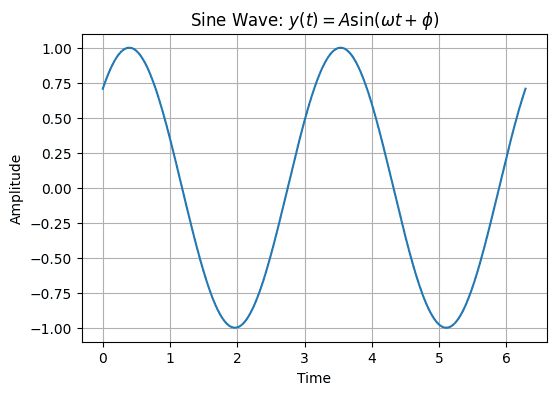

ただ、現実世界で聞こえるような音はこんなきれいな波ばかりでなく、こんな感じでごちゃごちゃなものが多いです。

  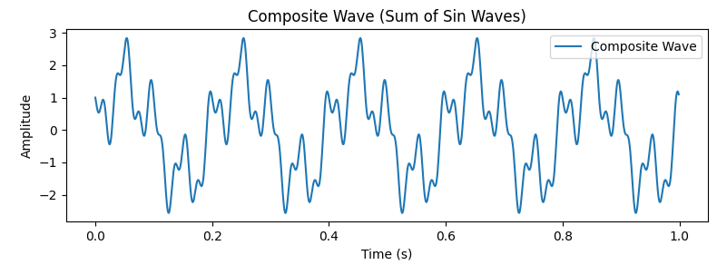

しかし、実は上の画像は複雑そうな波に見えますが、それを構成している成分は下の画像に見えるような 3 つの $\sin$ 波の重ね合わせでできています。

  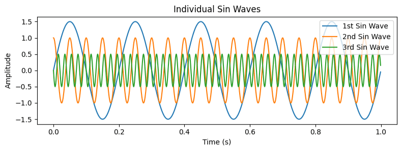

これらの波を足し合わせることによって先ほどの波が生成されます。

  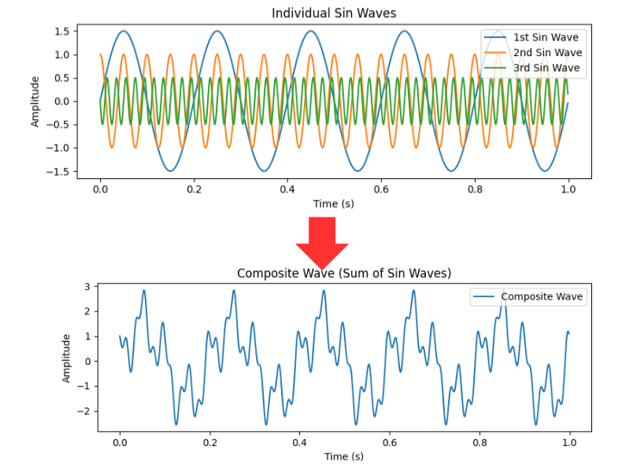

逆を言えば、どんな複雑そうに見える波であっても $\sin$ 波と $\cos$ 波の組み合わせに分解することができるのです。これがフーリエ変換です。

## 身近な場所での使用用途

こんなのいつ使うんだよ！と思った人もいるかもしれませんが、結構身近な場所で使われています。

1. **Wi-Fi の無線通信:**

   - フーリエ変換は、無線通信の信号処理に利用されています。Wi-Fi ルーターは、デジタル信号をアナログ信号に変換する際にフーリエ変換を使用し、異なる周波数のサブキャリアを使って情報を伝送します。

2. **スマートフォンの音声処理:**

   - 音声通話や音楽再生中、スマートフォンはフーリエ変換を用いて音声データを周波数成分に変換し、高音・低音の調整やエコーキャンセルなどを実現しています。

3. **デジタルカメラの画像処理:**

   - デジタルカメラは、撮影された画像をフーリエ変換を用いて周波数成分に変換し、シャープな画像やノイズリダクションを行っています。

4. **オーディオイコライザ:**

   - カーオーディオやホームオーディオのイコライザは、フーリエ変換を使用して音楽の周波数スペクトルを調整し、ユーザーが好みの音質に調整するのに役立ちます。

5. **心電図（ECG）の解析:**

   - 医療分野では、心電図の波形をフーリエ変換を用いて周波数解析し、心臓の異常な活動や不整脈などを検知するのに利用されます。

6. **雑音除去:**

   - 身の回りの信号にある雑音は以下のプロセスで取り除かれています。
     1. 信号をフーリエ変換して周波数を分析
     2. どれが信号化雑音化を見分ける
     3. 1.の周波数スペクトルに対して信号成分はそのまま、雑音には 0 をかける
     4. 逆フーリエ変換で元に戻す

などなど、他にも使われている分野は無限にあって、工業的には毎日の生活を成り立たせるために必要不可欠な分野となります。

## もうちょっと詳しく説明

### フーリエ級数展開（Fourier Series Expansion）

先ほどの項で、フーリエ変換によって複雑そうな信号は $\sin$ 波と $\cos$ 波に分解できるよ、ということを書きました。

ということは、です。カンいい人はもう気づいたかもしれませんが、逆を言えば、この二つの波を足し合わせればどんな波でも生成することができるというわけです。この手法はフーリエ級数展開といいます。

  <strong>フーリエ級数</strong>

$$
f(x) = \frac{a_0}{2} + \sum_{n=1}^{\infty} \left( a_n \cos\left(\frac{2\pi n}{T}x\right) + b_n \sin\left(\frac{2\pi n}{T}x\right) \right)
$$

- $f(x)$ は周期 $T$ の周期関数
- $a_0$ は直流成分（平均値）
- $a_n$ は余弦項の振幅
- $b_n$ は正弦項の振幅

この式は、周期関数 $f(x)$ を無限個の余弦関数と正弦関数の和で表現するものです。各項には異なる周波数が含まれ、それぞれの振幅 $a_n$ と $b_n$ によって重み付けられます。

なお、ここで出てくるフーリエ係数は以下のようにして求めることができます:

$$
a_0 = \frac{2}{T} \int_{0}^{T} f(x) \,dx
$$

$$
a_n = \frac{2}{T} \int_{0}^{T} f(x) \cos\left(\frac{2\pi n}{T}x\right) \,dx
$$

$$
b_n = \frac{2}{T} \int_{0}^{T} f(x) \sin\left(\frac{2\pi n}{T}x\right) \,dx
$$

これらのフーリエ係数は、関数 $f(x)$ と各余弦・正弦関数との内積を計算することで得られます。 $a_0$ は関数の平均値に対応し、 $a_n$ と $b_n$ はそれぞれ余弦項と正弦項の振幅を示しています。

あと、この分野の式の書き方にはこれ以外にも流派があります。

例えば、フーリエ係数の $a_0$ が ÷2 されていないものもありますが、この部分は周期性とは全く関係なく、波の上下を変化させているだけなので気にしなくて OK です。

あとは積分範囲が異なる表記も存在しますが、こちらも数式の意味としては同じです。 $a_n$ と $b_n$ は扱っている波が周期関数なので、数学的には 1 周期分を積分範囲としていれば計算結果は同じになるからです。そうは言っても便宜上積分範囲は $T$ または $[-T/2, T/2]$ であることが多いです。

ただ、ここでの注意点があくまでフーリエ級数展開は周期的な波形のみしか表現できないということです。上の式を見てもらえれば分かるように、ただ基本周期 $T$ の整数倍の重ね合わせでできているだけなので。

それと、このフーリエ級数展開は複素数を用いてもっとシンプルな形で表現することもできます。

  <strong>複素フーリエ級数</strong>

$$
f(x) = \sum_{n=-\infty}^{\infty} c_n e^{i \frac{2\pi n}{T}x}
$$

- $f(x)$ は周期 $T$ の周期関数
- $c_n$ は複素フーリエ係数

なお、複素フーリエ係数 $c_n$ は次のように表されます:

$$
c_n = \frac{1}{T} \int_{-\frac{T}{2}}^{\frac{T}{2}} f(x) e^{-i \frac{2\pi n}{T}x} \,dx
$$

- $T$ は周期
- $i$ は虚数単位 ( $i^2 = -1$ )
- 積分は周期関数 $f(x)$ に対する積分

この式では、各 $n$ に対応する複素フーリエ係数 $c_n$ は、元の関数 $f(x)$ を複素指数関数 $e^{i \frac{2\pi n}{T}x}$ で重ね合わせることによって計算されます。これにより、複素数の和で関数が表現されます。こちらの $e^{i \frac{2\pi n}{T}x}$ 以降の部分を成分として、 $c_n$ はその重みづけを表現したものになります。

虚数単位はここでは $i$ となっていますが、工学系分野だと $i$ が電流とかの記号と紛らわしくなってしまうので、 $j$ が好まれたりもします。

ちなみにここで出てくる $e^{i \frac{2\pi n}{T}x}$ という部分はオイラーの等式由来のものです。オイラーの等式は数学史上もっとも美しい式、なんて言われていますね。

  <strong>オイラーの等式</strong>

$$
e^{ix} = \cos x + i\sin x
$$

なんでオイラーの等式が出てくるかということですが（本筋からちょっと逸れます）、まあテキトーに $e^{ix}$ をマクローリン展開していき、実部と虚部に分解するとあら不思議、 $\sin x$ と $\cos x$ の足し合わせで表現できるじゃない！ということで、この分野と相性がいいわけです。具体的には、 $\sin$ と $\cos$ が複素協共役の関係で表現されることがここから分かります。

詳しい計算過程は以下の通りです。

  <strong>オイラーの等式の照明</strong>

$e^{ix}$ のマクローリン展開:

$$
e^{ix} = 1 + ix + \frac{(ix)^2}{2!} + \frac{(ix)^3}{3!} + \frac{(ix)^4}{4!} + \cdots
$$

$ix$ を整理していくと:

$$
e^{ix} = 1 + ix - \frac{x^2}{2!} - i\frac{x^3}{3!} + \frac{x^4}{4!} + \cdots
$$

ここで $\sin x$ と $\cos x$ のマクローリン展開は...:

$$
\sin x = x - \frac{x^3}{3!} + \frac{x^5}{5!} - \frac{x^7}{7!} + \cdots
$$

$$
\cos x = 1 - \frac{x^2}{2!} + \frac{x^4}{4!} - \frac{x^6}{6!} + \cdots
$$

これらを比較して用いて $e^{ix}$ のマクローリン展開を実部と虚部に分けると:

$$
e^{ix} = \cos x + i\sin x
$$

よって、オイラーの等式が得られる:

$$
e^{ix} = \cos x + i\sin x
$$

### フーリエ変換（Fourier Transform）

少し前座が長くなりましたが、フーリエ変換の元となるフーリエ級数展開というのは、全ての波は正弦波の重ね合わせで表現できる、ということでした。

フーリエ変換はこの反対で、複合信号を異なる単純な周波数成分に分解することです。

ただ、先述のようにこちらのフーリエ級数展開で扱う信号は周期性を持つことを前提として話が進められています。ですが、実際に実データを扱う時は非周期信号を扱うことのほうが多いと思います。

じゃあどうするのかというと、周期を無限大と考えてフーリエ変換を実行すればこの問題は解決します。なぜかというと、周期を無限大として考えればそもそも周期性がないという表現ができないからです（言語化が難しい）。

私たちが普段「これは周期性がある、ない」などと判定しているのは、ある特定の期間だけデータを観察した時の話に過ぎません。そりゃ無限大のデータなんて観察できないので当然っちゃ当然ですが。

逆を言えば、周期性を持っていないように見えても実は周期が長すぎてその一部分だけを見ているから周期性が無いように見えているだけかもしれません、ということです（ひねくれすぎ笑）。ワンチャン 1 兆年、1 京年とかのレベルで観察すれば周期性が実はあった！なんてことになるかもしれないので。

フーリエ変換の式としてはこんな感じになります。

  <strong>フーリエ変換</strong>

$$
X(f) = \int_{-\infty}^{\infty} x(t) e^{-i2\pi ft} \,dt
$$

- $x(t)$ は入力信号（時間領域の信号）
- $X(f)$ は出力信号（周波数領域の信号）
- $f$ は周波数（Hz）
- $i$ は虚数単位で、 $i^2 = -1$

これを行うことによって、時間領域の関数を（角）周波数領域の関数に変換して観察することができるようになります。フーリエ変換の結果から信号の周波数成分が得られるので、さまざまな信号処理の応用で使用されています。

周期を無限大として考えているくせになんで都合よく計算できるんだ！と思うかもしれませんが、先述のようにここではこうすることによって取り扱う信号を「周期性がある関数」と見なしているのでこうやって実行できるわけです。

あと、これと似たような形のものにラプラス変換というものがあります。

  <strong>ラプラス変換</strong>

$$
F(s) = \int_{0}^{\infty} f(t) e^{-st} \,dt
$$

- $f(t)$ は入力信号（時間領域の信号）
- $F(s)$ は出力信号（ラプラス変換された信号）
- $s$ は複素平面上の複素変数（ $s = \sigma + j\omega$ ）

この式は、入力信号の時間領域を指数関数によって重みづけして積分し、その結果を複素平面上の変数 $s$ に関する関数として表現しているものです。

時間領域の信号を周波数領域に変換するフーリエ変換と似ていて分かりづらいですが、ちょっと調べてみたらこんな感じの違いがあるっぽいです。

**ラプラス変換**:

- **対象**: 連続時間信号や関数
- **範囲**: $t \geq 0$（非負の時間）
- **変数**: $s = \sigma + j\omega$（複素平面上）
- **特徴**: 初期条件への対応が可能

**フーリエ変換**:

- **対象**: 連続・離散時間信号や関数
- **範囲**: 任意の時間
- **変数**: $j\omega$（純粋な虚数）
- **特徴**: 初期条件は考慮されない

フーリエ変換ができる条件は関数が絶対可積分ということは知っていたんですが、どうもラプラス変換はそれ以外の条件でも適用できるらしいです。

ラプラス変換は勉強したことが無いので私はさっぱり分かりません。今度暇なときにでもやろうと思います。

### 離散フーリエ変換（DFT：Discrete Fourier Transform）

ここでまたまた条件が追加されます。フーリエ変換で扱える信号は連続しているものに限るということです。式を見てもらえると分かるように $\int$ が使われているので、数Ⅲ でもおなじみの「関数はその区間で連続じゃなきゃ積分できないよ」ってことです。

ただ、それは理想上の話であって、コンピュータ上で常に連続したデータを扱えるとは限りませんよね。コンピュータ上で扱うようなデータは完全に連続しているわけではなく、とびとびになっている（離散データ）ことも多いです。

  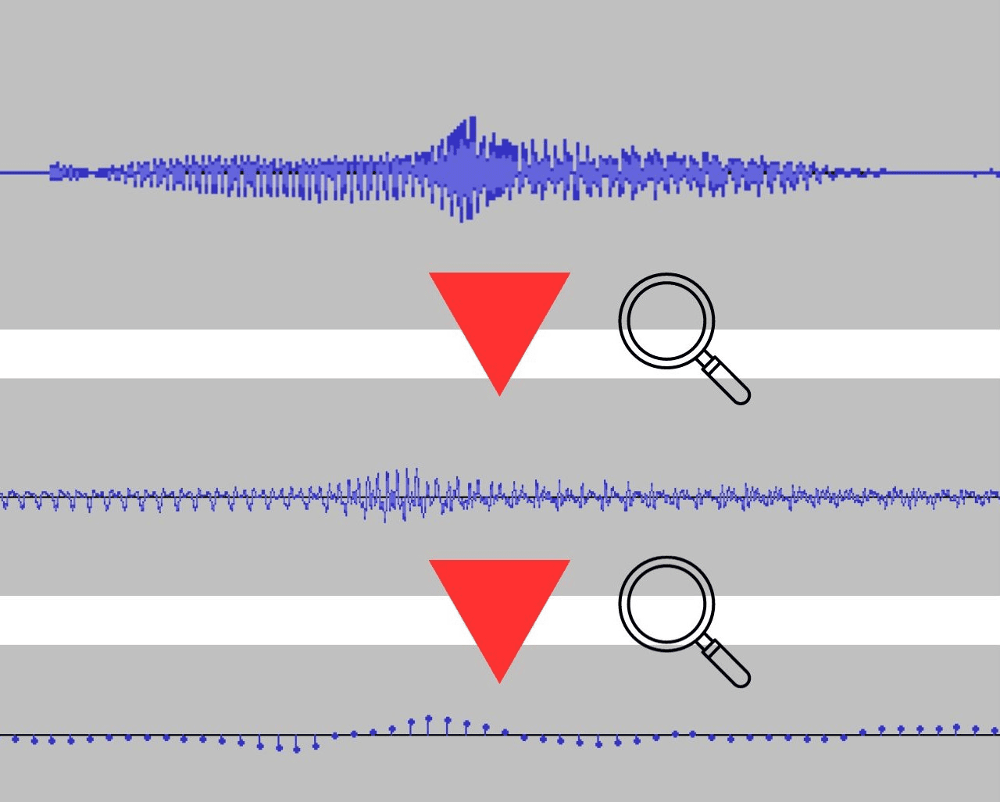

例えば上の写真を見てもらえば分かるように、一見すると連続しているような音声データも拡大してみるととびとびのデータの集合であることが分かりますね。まあ本当に連続していたら無限のデータサイズが必要になってしまうので、ある程度の所で打ち切りにする必要があるわけです。俗にいうサンプリング周期（データをサンプリングする間隔のこと）ってやつですね。

そのため、こちらの離散フーリエ変換はそういった離散的なデータでも扱えるように改良されたものになります。式としては以下のような感じになります。

  <strong>離散フーリエ変換</strong>

$$
X[k] = \sum_{n=0}^{N-1} x[n] e^{-i \frac{2\pi}{N}kn}
$$

- $x[n]$ は離散時間信号（離散的なサンプル）
- $X[k]$ は DFT の結果
- $N$ はサンプル数
- $k$ は周波数インデックス（ $0$ から $N$ -1 までの整数）

これは離散時間信号 $x[n]$ の離散フーリエ変換（DFT）です。離散的な性質から、サンプル数 $N$ 分の周期性を持っています。

名前からも分かるようにこちらは扱える信号は離散的で、かつ非周期信号でも大丈夫です。離散データを扱っているので、DFT を行った結果の振幅スペクトル（周波数スペクトルとも。フーリエ変換の結果の絶対値を、縦軸を振幅、横軸を周波数としてプロットしたもの）はデルタ関数的な見た目の、とびとびなものになります。これは次の高速フーリエ変換の項で実例を交えながら説明します。

### 高速フーリエ変換（FFT：Fast Fourier Transform）

こちらは離散フーリエ変換をコンピュータ上で高速に計算するためのアルゴリズムです。色々紛らわしい用語が増えてきて面倒になってきましたね。

以下が高速フーリエ変換の式です。

  <strong>高速フーリエ変換</strong>

$$
X[k] = \sum_{n=0}^{N-1} x[n] \cdot e^{-i \frac{2\pi}{N}kn}
$$

- $x[n]$ は離散時間信号（離散的なサンプル）
- $X[k]$ は FFT の結果
- $N$ はサンプル数
- $k$ は周波数インデックス（0 から $N-1$ までの整数）

FFTが普通のDFTよりも高速に計算できる理由は、アルゴリズムがデータサイズに対して対数的な計算量を持つためです。

通常の離散フーリエ変換（DFT）の計算量は $O(N^2)$となっていて、 $N$ が大きくなると計算が複雑になります。FFT は、 $N$ 個のサンプルから成る離散信号を $N/2$ 個の複素数から成る周波数成分に変換していて、計算量は $O(N log N)$ となっているので、データサイズが増えても計算量があまり増加しません。

こんな感じで FFT は DFT の計算量を $O(N^2)$ から $O(N \log N)$ に減少させられるので、大量の計算が必要になる大規模データやリアルタイム処理においてよく用いられています。なんと普通の DTF に比べると数十倍から数百倍高速に計算できるとも言われています。

あと、先述の通り FFT も DFT の一種で離散データを扱うので、結果から導かれる周波数特性は離散的になります。

例えばGitHub上のこのレポジトリのルートフォルダから見た`.\data`の中にあるずんだもんの「僕はずんだもんなのだ」という WAV ファイルの 1.00s から 1.32s まで（ $fs$ = 16000Hz  なので $N$ =512 点のデータ）を切り出し、 FFT（窓関数なし）をかけてみて結果を確かめてみましょう。ずんだもんの音声ファイルは[Google Drive](https://drive.google.com/file/d/16lkZocJoiXfFhE_HuDV6W2w2Xaj-tRoq/view?usp=drive_link)にもおいてありますので良ければどうぞ（形式はfs=16000Hz, Channel=monaural, Filetype=WAVにフォーマットしてあります）！

ちなみになんでずんだもんの音声をサンプルに用いたのかというと、単純に権利上の使い勝手が良かったからです。

  

話を戻します。そうすると、出力結果としてはこんな感じの若干デルタ関数的な周波数特性が観察できますね。

  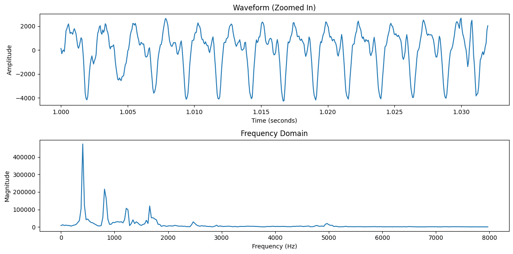

こういうフーリエ変換関係の計算を手でやろうとするとめちゃくちゃめんどくさいんですが、実際にコンピュータ上実装する際には機械が全部やってくれるので大丈夫です。
Python では難しいことは考えずに numpy などのライブラリを使って実行できるので。

こちらの実際のフーリエ変換のやり方は [こちらのJupyter Notebook](fft_test.ipynb) のほうを参照していただけると分かると思います。

もうちょっと写真を見せてFFTのイメージを掴んでみましょう。まずはもとのずんだもんの「僕はずんだもんなのだ」という音声の波形です。

  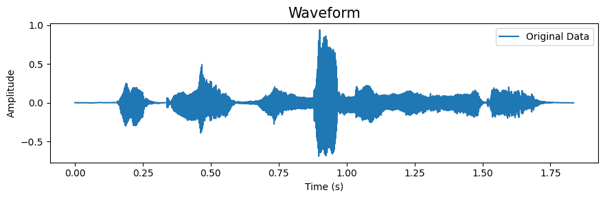

これにFFTをかけた結果、さっきのような離散的な振幅スペクトルが出てきたのでしたよね。

そして、この結果を縦軸周波数（Hz）、横軸時間（s）、色で振幅の程度を表現したものがスペクトログラムです（いわゆる声紋）。具体的には短時間フーリエ変換（SFFT：Short-Time Fourier Transform）した結果の短冊状の画像をペタペタと横の時間領域に並べたものだと思ってもらえればいいです。

  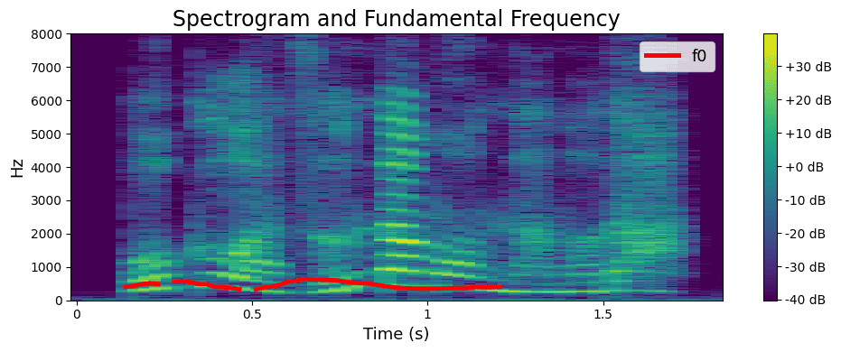

声紋分析なんかもこれを見ればできますね。ここで赤い線（ずんだもんの $F0$ 、声の基本周波数）が途中で途絶えているのはバグではなく、そもそもこの音声データが1秒ちょっとしかないのでそこまでしか記録できないからです。

試しに、WORLD（音声分析変換合成システム）のPython用wrapperであるPyWORLDを用いて音声ファイルの $F0$ 抽出をしてみると下のような画像になりました。今回はこの[F0抽出ができるJupyter Notebook](f0_extraction.ipynb)も作ってみたので、興味がある人はぜひ動かしてみてください。

  

ここでちょっと豆知識。刑事事件などの調査で出てきた指紋って絶対的な証拠として扱われているイメージがありますよね。でも実は、指紋と違って声紋は意外と人によって被ったりする部分が大きいので決定的な証拠にはならないらしいです。あと日常生活だと、電話で会話している時の音声も実は相手の声を聞いているわけではなくて、何十億通りあるそれっぽい似た声のサンプルを聞いているだけなようです。ちょっとビックリ。

もう一つ付け足ししておくと、上の振幅スペクトルについては縦軸を対数として取ることもできて、その場合は対数振幅スペクトルと呼ばれます。なんでわざわざ馴染みのない対数軸で見るのかというと、人間は音の心理量を対数的にとらえている（ウェーバー・フェヒナーの法則）上、振幅が大きくなってもケタが増えにくいので色々分析しやすかったりするからです。

実際に出力してみるとこんな感じのものになります。まあ全体の周波数特性事態を見てもだから何だという話ですが、一応置いときます。

  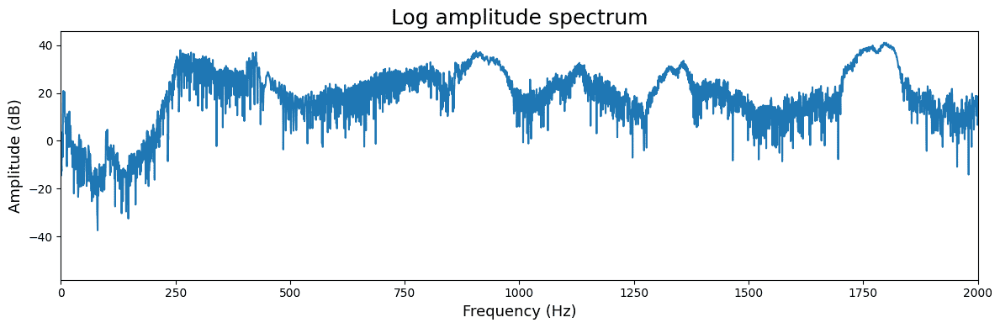

具体的には、音の単位量であるデシベル（dB）の振幅は以下の式によって元の振幅と基準振幅の比率の対数で表現されます。

  <strong>振幅のデシベル表現</strong>

$$
A_{\text{dB}} = 20 \log_{10}\left(\frac{A}{A_{\text{ref}}}\right)
$$

- $A_{\text{dB}}$ はデシベル単位の振幅
- $A$ は元の振幅
- $A_{\text{ref}}$ は基準振幅

### 逆フーリエ変換（IFT：Inverse Fourier Transform）

フーリエ変換が時間領域のデータを周波数領域に変換することなので、もちろんその逆の動作もあり、逆フーリエ変換といいます。この逆変換により、信号の周波数スペクトルから元の連続時間信号を復元することが可能です。これは次の式で表されます。

  <strong>逆フーリエ変換</strong>

$$
x(t) = \int_{-\infty}^{\infty} X(f) e^{i2\pi ft} \,df
$$

- $x(t)$ は元の連続時間信号
- $X(f)$ は連続時間フーリエ変換の結果
- $f$ は周波数

ちなみに、高速フーリエ変換の逆は逆高速フーリエ変換（IFFT：Inverse Fast Fourier Transform）となります。また、逆ラプラス変換というものもあって、これを用いるとラプラス変換された信号を時間領域の信号に逆変換することができます。

### 紛らわしい用語のまとめ

似たような概念がたくさん出てきたので、一度まとめておきます。

- **フーリエ級数展開**
  - 基本周期の整数倍の三角関数（正弦波）の組み合わせで周期的な関数を表現できる
  - 複素数を用いてスマートな表記にすることもできる（複素級数展開）
  - 周期的な信号を扱う
  - 信号は連続的である必要がある
  - 扱う周波数は基本周期の整数倍である
  - 振幅スペクトルもデルタ関数的な、とびとびな見た目になる
- **フーリエ変換**
  - 複合信号を異なる単純な周波数成分に分解することができる
  - 周期が無限大の非周期的な信号を扱う
  - 信号は連続的である必要がある。
  - それに伴い、振幅スペクトルも連続なスペクトルになる
- **離散フーリエ変換**
  - フーリエ変換では扱えなかったとびとびの（離散的な）データも扱えるような形にしたもの
  - 非周期的な信号を扱う
  - 信号は離散的でもよい
  - 扱う周波数は基本周期の整数倍である
  - 振幅スペクトルもデルタ関数的な、とびとびな見た目になる
- **高速フーリエ変換（FFT）**
  - 離散フーリエ変換をコンピュータ上で素早く扱えるように計算量を減らしたもの
  - 今日の様々な分野で幅広く使用されている

## フーリエ変換で使う他の概念

### サンプリング周波数

高校の物理で扱った波の時と同じく、サンプリング周期はサンプリング周波数の逆数になります。そして、そのサンプリング周波数は 44100Hz が良く使われます（映像業界だったら 48000Hz とかも主流です）。これには人間の可聴域（audible range）が関係しています。

人間の可聴域は一般に 20Hz ～ 20kHz 程度とされていて、高周波数帯の音ほど聞こえづらくなります（コウモリの超音波が人間の耳には聞こえないことを想像してもらえると分かりやすいです）。実際には 15kHz 以上の音が聴覚に及ぼしている影響は少ないとされています（竹内京子 and 木村啄也, たのしい音声学. くろしお出版, 2019. など）。

ここでちょっとアナログ（連続）データをデジタル（離散）データとして扱うコンピュータならではの弊害が出てきます。

信号を復元する際に出てくる標本化定理というものがあります。実際にアナログ（連続）データをデジタル（離散）データをに変換する A/D 変換（標本化＆量子化）というプロセスがあるのですが、その際に扱う信号の周波数帯がサンプリング周波数の 2 分の 1 より小さいと高周波成分が正確に復元できず、エイリアシングと呼ばれる歪みが生じてしまいます。他にも現実世界だとプロペラだったりタイヤなどが逆回転に見えるストロボ効果もこれに当たります。

なぜ正確に復元できないかというと、高周波がサンプリング周波数の半分以下の周波数に折り返されてしまい、誤った周波数としてデジタルデータに記録され、本来削除されるべきデータが再び現れてしまうからです。

これを防ぐために、標本化定理の中にはサンプリング周波数の 2 分の 1 以下（ナイキスト周波数という。2 分の 1 未満とすることもある）のデータしか採用してはいけませんよ、というルールが設けられています。逆をいうと、そのためには本来表現したい周波数帯の 2 倍以上の周波数帯まで音をサンプリングする必要があるわけです。

実際には、アンチエイリアシングフィルタというものが使われていて、標本化定理のひずみを防ぐために利用したい周波数帯の 2 倍以上の周波数帯はカットするようになっていることが多いです。

となると、じゃあサンプリングすればいい範囲は人間の可聴範囲の 20000Hz×2 の 40000Hz まででいいじゃん！という話になると思います。まあそれでもいいのですが、実際の音楽業界などでは表現を豊かにするために細かい倍音成分までも収録する必要があるようで、その遊びの部分を考慮した結果 44100Hz が多く用いられているそうです。

まあデジタルデータは軽量ですし整数でデータを保存しているので破損に強いんですが、こういう歪みが発生したりデータの四捨五入のせいで本物とのズレ（量子化雑音）とかが発生する可能性もあるので一長一短ですね。

### 周波数分解能

周波数分解能とは、離散フーリエ変換でどこまで区切れるか、を表す識別の限界のことです。 サンプリング周波数（ $fs$ ） ÷ データ数（ $N$ ） で表現されるので、データ数を大きくする or サンプリング周期を短くすると周波数分解能が上がります。

例えば用いるデータの範囲が 0.005s なら周波数分解能は 200Hz ということになります。

こちらは用いる窓が小さいほど周波数分解能が細かくなります。が、周波数分解能 = 時間分解能の逆数、であるため、周波数分解能を上げると時間分解能は低下してしまいます。

これを不確定性原理といって、周波数分解能と時間分解能の両者はトレードオフの関係にあるのでどちらかをいい塩梅で調節しなくてはならないわけです。

ちなみに、周波数分解能を高くして分析したものは狭帯域分析と呼ばれ、声の基本周波数（アクセントなどが追える）などの時間変化を観察するのに向いています。周波数分解能を高くすると分析に時間がかかるので注意です。

逆に時間分解能を高くしたものは広帯域分析といい、フォルマントの時間的変化の観測に向いています（どこからが広帯域分析、狭帯域分析なのかは明確には区別されていませんが）。

両者のスペクトルを見ると，同じ信号を用いていても基本周波数の見え方が異なってくる点に注意です。

### 窓関数

先ほども書いたように、高速フーリエ変換では非周期的な信号を扱う関係でデータを処理する範囲を決めて実行していきます。その外では同じ規則性を持った信号が繰り返されているという過程のもと計算を進めていくわけです。

ただ、実際の信号はそう都合よく周期が繰り返されているか分からないし、どこまでがその周期なのかを見抜いて適切なサンプリング点数で FFT を行うことはまず無理です。

例えば先ほどのずんだもんの音声データの 1.01 から 1.015 まで（範囲はテキトー）の間のデータを取り出して FFT をかけたいとします。すると、切り出したデータが以下のようになっていたらどうでしょう？

  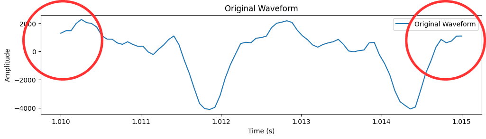

これだと指定した範囲の開始時刻と終了時刻の両端が 0 になっていませんよね。本来きちんと 1 周期分を拾ってきたのなら、この波の両端の値は同じになるはずです。

ですが、先述のように本当にぴったり 1 周期分！となるようなデータをこの中から見つけてくることは現実的に難しいです。

この問題を解決するために生み出されたのが窓関数です。これは測定した範囲の両端のデータを 0 にすることにより、実質的に無理やり周期性を見出してしまおうという試みです。

どういうことかよく分からないと思うので、画像と共に以下解説します。

まず、窓関数の具体例を出すと、ハミング窓が有名です。ハミング窓は、信号処理やスペクトル解析などで使用される窓関数の一つであり、時間領域の信号に対して加重をかけるための関数です。私もこちらをよく採用します。

こちらは以下のような式で表されます。

  <strong>ハミング窓</strong>

$$
w(n) = 0.54 - 0.46 \cos\left(\frac{2\pi n}{N-1}\right)
$$

- $w(n)$ はハミング窓によって加重される係数（窓関数）
- $n$ は時間領域の離散的なサンプルの添え字
- $N$ は窓の長さ

これらの式を信号に適用することによって、端の部分における振幅を抑えつつ、中央部分を重点的に扱う特徴があります。これにより、スペクトル解析において波形の端の影響を減少させる効果があります。

実際にこういった特徴を利用して、ハミング窓は主にフーリエ変換や周波数解析において、波形を分析する際に信号を適切に処理するためによく使用されます。

これを先ほどのデータにかけてみましょう。するとこのように形が変化します。

  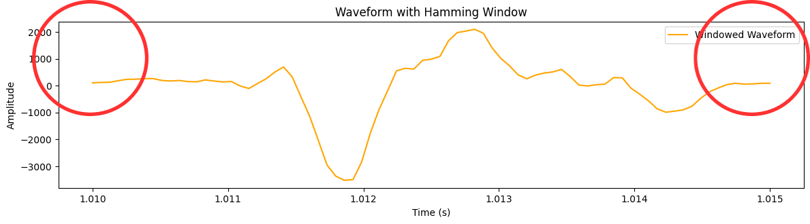

こうすると両端が自然な形で 0 になりましたね。両端が同じ値ということはこれを一周期分として認識しても差し支えなくなるので、無事 FFT が行えるというわけです。

参考までに、ハミング窓をかける前とかけたあとでどのように波形が変化したかもう一度比較してみましょう。

  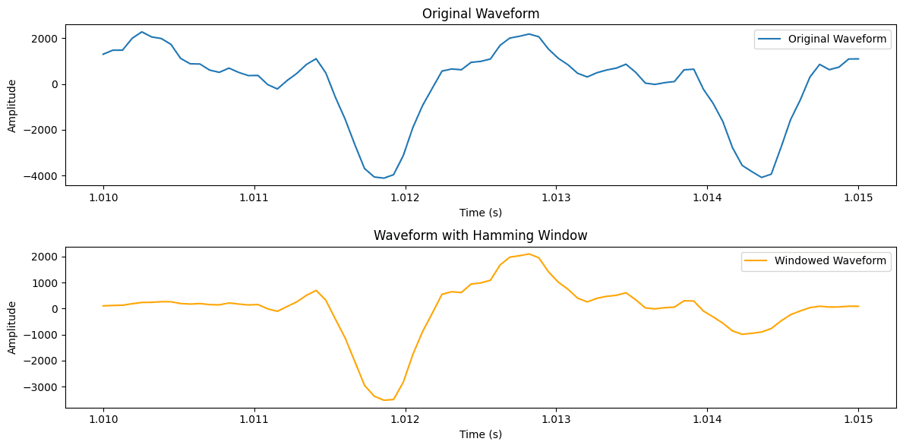

ただ、なんでもかんでも窓関数を使えばよいというわけではなくて、こちらを使うとデータの漏れ（リーク）は軽減される代わりに、データの頂点（ピーク）が低くなってしまうという欠点もあります。

例えば、ずんだもんの音声の 1.000 秒から 1.032 秒までのデータを取り出してみましょう。

なんで切り出す範囲を 0.032 秒にしたのかというと、FFT を行う計算上の都合からデータ点数を 2 の $n$ 乗にしたかったからです。こちらの音声ファイルのサンプリング周波数が 16000Hz なのでサンプリング周期は 1/16000s になって、その 512 倍（2 の 9 乗）が 0.032 秒になるわけですね。

下の画像は分割したデータの元の波形を青色、ここにハミング窓を適用した波形をオレンジで示しています。

  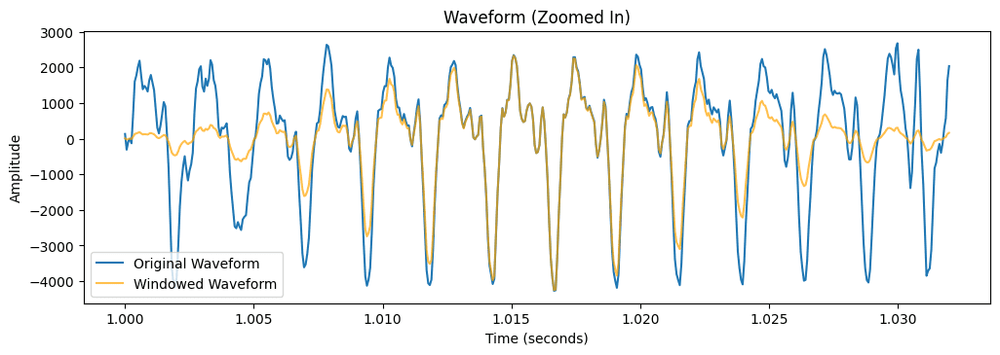

こちらを FFT をしてみるとどうなるでしょうか？振幅スペクトルの結果を比較してみましょう。

  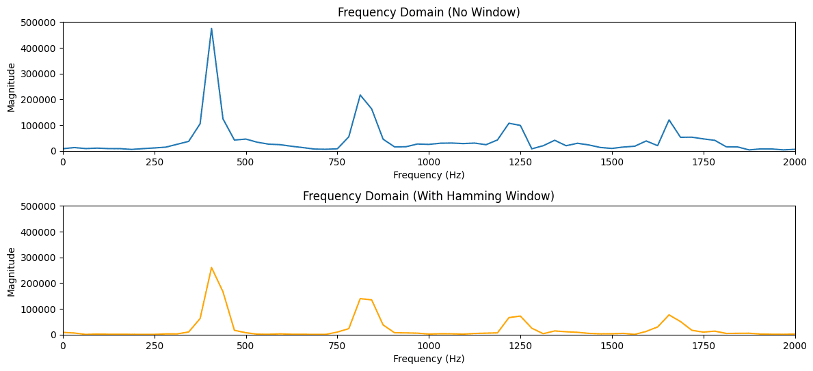

上で述べたように、確かにリークは軽減されていますが、振幅のピークが低くなっていますね（今回の場合はちょっと影響が大きすぎたかも）。

が、どちらにしろ窓関数を適用するということは無理やり波形を変化させるということです。実際に聞こえてくる信号と比較すると影響も否めませんので注意が必要です。

#### よく使う窓関数の特徴まとめ

  <strong>ハミング窓（Hamming Window）</strong>

$$
w(n) = 0.54 - 0.46 \cos\left(\frac{2\pi n}{N-1}\right)
$$

- $w(n)$ はハミング窓によって加重される係数（窓関数）
- $n$ は時間領域の離散的なサンプルの添え字
- $N$ は窓の長さ
- ハニング窓よりも側丘の急激な変化を防ぐことができる
- ハニング窓よりもメインローブが狭く周波数分解能が高く、両端が不一致でもよい
- 近接した周波数成分を持つ信号を分析、分離できるが、サイドローブが大きい代わりに振幅の小さい周波数成分を分析できない
- パワー減少率：4.00dB

  <strong>ハニング窓（Hanning Window）</strong>

$$
w(n) = 0.5 - 0.5 \cos\left(\frac{2\pi n}{N-1}\right)
$$

- $w(n)$ はハニング窓によって加重される係数（窓関数）
- 中心から離れるにつれ側丘の大きさが急激に小さくなるため、振幅の小さい周波数成分が振幅の大きい周波数に埋もれる
- メインローブ（主成分）の周波数分解能は高くないが、サイドローブが小さい
- パワー減少率：4.26dB

  <strong>矩形窓（Rectangular Window）</strong>

$$
w(n) = 1
$$

- $w(n)$ は矩形窓によって加重される係数（窓関数）
- 比較的サイドローブが大きいため、サイドローブが積み上がりやすい
- サイドローブが積み上がった位置に小さなレベルの周波数成分があると埋もれるが、比較的メインローブの幅が狭いため、周波数成分をより細かく分離できる

  <strong>ブラックマン窓（Blackman Window）</strong>

$$
w(n) = 0.42 - 0.5 \cos\left(\frac{2\pi n}{N-1}\right) + 0.08 \cos\left(\frac{4\pi n}{N-1}\right)
$$

- $w(n)$ はブラックマン窓によって加重される係数（窓関数）
- $n$ は時間領域の離散的なサンプルの添え字
- $N$ は窓の長さ
- ハミング窓よりも振幅の小さい周波数成分を検出することができる
- メインローブの周波数分解能が悪い。サイドローブが小さく、小さな振幅の周波数成分でも分析することができる

### 音声スペクトルの分析について

この場合は短時間スペクトルを求めることになりますので、その具体的な方法について少し解説します。

#### 大まかな分析方法

まずこれには

1. **ノンパラメトリック分析法**
2. **パラメトリック分析法**

の二つがあります。

ノンパラメトリック分析法とは、モデルを仮定しないで信号に対して周波数全域を分析するやり方です。例としては、短時間 DFT 分析やケプストラム分析がこれに当たります。

これに対してパラメトリック分析法とは、対象信号に特定のモデル化を行ってそのモデルを表現する特徴パラメータを抽出することです。線形予測分析なんかがその例です。

#### スペクトル包絡の分析について

あと、TTS においてはスペクトル包絡の分析がカギになります。

スペクトル包絡とは、音声信号のスペクトルから、音声の基本周波数や共振の影響を取り除いた残差のことです。これが音声の個々の音や発音の特徴を表すため、TTS のモデリングにおいて重要な役割を果たすわけです。

こちらの抽出方法にも二つ有名なものがあります。

1. **ケプストラム法**
2. **線形予測法（LPC）**

ケプストラム法とは、ノンパラメトリック分析法の一種で、短時間スペクトル上で微細構造と包絡構造を分けるやり方のことです。

ちなみにケプストラムとは信号の SFFT の対数を取って、それを逆フーリエ変換したもののことです。この領域では微細構造と包絡構造に対応する各成分を容易に見分けることができます。

それに対し、線形予測法とはパラメトリック分析法の一種で、声道の共振特性をモデリングするやり方のことです。自己回帰モデルに基づいています。

### 用いるサンプルデータのフォーマットについて

- サンプリング周波数：基本 16kHz がよい
  - 音響分析には 8kHz までが重要だと言われているため、先ほどの標本化定理の理屈から 16kHz のサンプリング周波数で分析すること多い
  - 本格的な研究でも 24kHz 程度までのサンプリング周波数だったりする
- ファイル拡張子：WAV
  - mp3 などは WAV より軽量なのでよく使われているが、これは高周波数の音がカットされているため。これは音響分析にはあまり適していない
- チャンネル数：モノラル形式
  - 音声が分析しやすくて良い
  - 手持ちの音声ファイルがステレオの場合はテキトーなソフトで変換しておくこと
- データ点数：2 の $n$ 乗
  - FFT の計算量を減らす都合上こうなる
  - 例えば 1024 点（2 の 10 乗）など
  - サンプリング周波数などにもよるが、一般的には 256 ～ 2048 点で OK
  - ただし解析対象の基本周波数が高いことが事前に分かっている場合はもう少し短い 256 点でもよい
  - 2048 点は音声認識等の用途では長いが、「声の大きさ」の時間的な変化を計測する場合なら妥当
  - 窓よりも波長が長くなってしまうと解析できないのでそこだけ注意
- 時間幅：一般に 20 ～ 30 ms くらい
  - 人間の聴覚が音色の違いを区別するために必要な時間間隔は大体数十 ms 程度とされる
  - 言い換えれば、理論上人間の聴覚は 512 点ほどの信号から音色を取り出しているということである
  - 音の大きさそのものは大体 125ms 程度で区別している

実際に今回サンプルとして用いるずんだもんの「僕はずんだもんなのだ」という音声も、サンプリング周波数 16000Hz のモノラル形式の WAV ファイルで用意設定してあります。

### その他注意事項など

  <strong>Q：振幅スペクトルを表示する際に何かすることはある？</strong>

A：FFT の結果は複素数で返ってくるので、結果に対して絶対値を付けておきましょう。Python 上で実行するなら abs()なんかを付ければいいと思います。

  <strong>Q：窓関数をかけたら曖昧な周波数特性しか把握できないけど、そんなもので人間の聴覚特性などの影響を調べられるの？</strong>

A：音声認識ではスペクトルから細かい変動を取り除く MFCC という処理を加えているので、スペクトルがデルタ関数的であることは人間の聴覚的にはあまり関係がないです。むしろ連続的で滑らかなスペクトルが適切なのでそれで大丈夫です。

  <strong>Q：そもそも波形の違いを吟味せずにフーリエ変換の結果だけから何か語れることがあるの？</strong>

A：例えば音色などの影響を周波数特性から調べることができます。じつは波形の違いが音色にどういった影響を与えているのかはあまり良く分かっていないようです。

人間の聴覚は振幅そのものではなく対数軸上で違いを見ているので、周波数特性のほうが大事なのです。例えば、高さに関して 440Hz の 1 オクターブ下が 220Hz、その上が 880Hz、といった具合で、心理量は物理量の対数に比例して認知されます（ウェーバー・フェヒナーの法則）。

  <strong>Q：複数データを比較する際の注意事項はある？</strong>

A：特に収録時の条件が違う 2 つ以上のデータを比較する場合は藤崎(1971)の研究（藤崎博也 and 須藤寛, “日本語単語アクセントの基本周波数パタンとその生成機構のモデル,” 日本音響学会誌, vol. 27, no. 9, pp.
445–452, 1971.）のように時間領域や周波数領域で正規化を行ってから比較することが望ましいです。高校生の時の私にはやり方が分からなかったのでそのままデータから読み取れることを比較していましたが、厳密には良くないです。

  <strong>Q：どの程度まで音色に関する影響を周波数特性で議論できるの？</strong>

A：あまり細かい音色の違いまでは分からない。フーリエ変換は人間の聴覚特性の近似としては精度が粗すぎし、窓関数をかけたことによって波形に歪みを与えているので、これらの影響のほうが本来の細かい違いよりも大きくなってしまう。

  <strong>Q：サンプリング周波数は本当に 16kHz でいいの？</strong>

A：大体の場合は fs=16kHz で OK！
これより低い場合は、人間の聴覚に大きな影響を与えている 8kHz 以下の音までカットしてしまう可能性があるのであまりよくありません。ではこれよりもサンプリング周波数が高い場合は？

この場合は、別にやってもいいけどあんまり意味がないからやらない、という認識で大丈夫です。世の中に出回っている音声のサンプリング周波数は 44100Hz だったりすることもありますが、あくまで音響分析では 8kHz 以上の音が聴覚に与える影響はないだろうと言われているため重視しないのです。本にもそう書いてありますし、大学の教授などにメールしてみたこともありますが大体そういう返事が返ってくるのでそうなのでしょう。

具体的に高周波数帯の音声があまり聴覚に影響を及ぼしていないということを調べるには、音声に対して 15kHz 以上のみを通すハイパスフィルタをかけて聞いてみると分かりやすいと思います。もっと言うと、なんならフォルマントとして表現できる中で重要なものは 4kHz 未満くらいに現れるようです。

ただ究極の話をすると違うかもしれなくて、15kHz 以上のような高周波数帯の音を含むことによって低周波数帯にもうなりが発生して、より人間の発話に忠実な音声となる可能性も指摘されている（鈴木陽一, 赤木正人, 伊藤彰則, 佐藤洋, 苣木禎史, and 中村健太郎, 音響学入門. コロナ社, 2011.）こともなくはないです。

そのため、実際問題 8kHz 以上の音が我々の耳にどれくらいの影響を及ぼしているのかがあるのかは不明です。感情合成音声の界隈の WORLD などで有名な森勢将雅先生も、YouTube かどこかでそういった微妙な違いが最終的な品質の違いに影響してくることもあるとおっしゃられていたので、難しい所なのだと思います。

### コラム：藤崎モデル

出てきた $F0$ を見て何が分かるんだという人もいるかもしれませんが、喉などの動きから $F0$ のピッチパターンをモデル化することができます。こちらに音声界隈では有名な藤崎モデルというものがあるので、せっかくなので紹介しておきます。

> 藤崎モデルでは，甲状軟骨の二つの独立な運動(平行移動と回転)に伴う声帯の長さの変化の合計が $F0$ の時間的変化をもたらすと解釈され，声帯の伸びと対数 $F0$ の変化が比例関係にあるという仮定に基づき $F0$ パターンがモデル化される。
>
> 甲状軟骨の平行移動運動に関係する $F0$ パターンをフレーズ成分，回転運動に関係する $F0$ パターンをアクセント成分と呼び，それぞれ $y_{\text{p}}(t)$ , $y_{\text{a}}(t)$ とする。ただし， $t$ は時刻である。$y_{\text{p}}(t)$ の生成過程(フレーズ制御機構)はフレーズ指令と呼ぶパルス波を入力とした臨界制動の二次線形系 $y_{\text{a}}(t)$ の生成過程(アクセント制御機構)はアクセント指令と呼ぶ矩形波を入力とした臨界制動の二次線形系により表現される。
>
> 以上の二つの成分と，声帯の物理的性質によって決まるベースライン成分 $y_{\text{b}}$ の和 $y_{\text{p}}(t)+y_{\text{a}}(t)+y_{\text{b}}$ で $F0$ パターン $y(t)$ を表したものが藤崎モデルである（亀岡弘和, ルルージョナトン and 大石康智, ”音声 F0 パターン生成過程の確率モデル,” 日本電信電話 (株) NTT コミュニケーション科学基礎研究所 より）

人間の声帯ですら数学的に表現できてしまうって、自然は面白いですね。

## 用語解説

### 信号と波形

- 信号: 物理・化学量の変化などを連続的に観察した結果。
- 規則信号: 同じものを周期的に繰り返す信号。
- 定常信号: 変化が因果律に従っている信号。
- チャープ信号: 周波数がだんだん上がっていく信号。
- ノコギリ波: 連続的な均等な上昇（または下降）勾配を持つ波形。
- 矩形波: 短いパルスが一定の周期で繰り返される波形。
- 三角波: 直線的な上昇と下降を繰り返す波形。
- 白色雑音: ホワイトノイズ。あらゆる位相の $\sin$ 波を位相をランダムにして重ね合わせると作ることができる。
- 純音: 一つの周波数のみで構成される波。

### 波形特性

- 位相: 時間軸の信号のズレ。$\sin$ と $\cos$ 波では周波数特性が変わらなければ同じように聞こえる。
- 周期（ $T$ ）: 波などが繰り返される時間。
- 周波数（$f$ ）: 1 秒間に繰り返される周期の数。
- 基本周波数（ $F0$ ）: 発声時に声帯が振動する基本的な周波数。
- 角周波数（ $\omega$ ）: 一秒間にどれくらいの角度進んだかを表す。

### サンプリングと周波数解析

- サンプリング: データを取得すること。
- サンプリング周波数（ $fs$ ）: 1 秒間でどれくらいのデータを取得するかを表す。
- サンプリング周期: サンプリングする間隔。
- 振幅スペクトル: フーリエ変換の結果の絶対値を、縦軸を振幅、横軸を周波数としてプロットしたもの。
- パワースペクトル: 振幅スペクトルの二乗を取ったもの。
- スペクトログラム: 振幅スペクトルを小さな時間で区切ってプロットしたもの。
- リーケージエラー: FFT の開始点と終了点が一致していないとスペクトルが広がる現象。

### フィルタと周波数変換

- 低域通過フィルタ: 低い帯域の音声のみを通す。
- 高域通過フィルタ: 高い帯域の音声のみを通す。
- 帯域通過フィルタ: 特定の帯域の音声のみを通す。
- 帯域阻止フィルタ: 特定の帯域の音声を通りづらくする。
- 聴覚フィルタ: 人間の耳は、帯域の異なるフィルタをたくさん重ねて音声を聞き取る。
- メル尺度: 音の高さ（ピッチ）をモデリングするための尺度。
- デルタ関数: ある引数の時に値が無限大、それ以外の点ではゼロの値をとる数学的な関数。

### その他

- 自己相関関数: データの相対評価に利用される関数。
- エルゴード性: たくさんの平均をとっていくと、いずれはある値に収束する性質。

## おすすめ図書

- [『独習！ 信号処理』](https://amzn.asia/d/5ozeAvd)：鈴木真人 (著)
  - 信号処理の基本について一通り書かれている。
  - 具体的には周波数解析、フィルタ、相互相関関数などについて学べる。
  - 分量が少なく、読破しやすい。
  - 一部統計については数学の細かい知識がないと理解できない部分もある。
  - 「信号解析装置」ソフトなど教材のダウンロードサービス付きで、実際にパソコンを動かしながら信号処理について学べる。
- [『高校生からわかるフーリエ解析 (専門数学への懸け橋)』](https://amzn.asia/d/88RoRQG)：涌井 良幸 (著)
  - フーリエ変換の入門書はいろいろあるが、これが一番わかりやすい。
  - これさえ買っておけばフーリエ変換の勉強は間違いなし。
  - イラストも入っていて説明が丁寧。
- [『解析学図鑑: 微分・積分から微分方程式・数値解析まで』](https://amzn.asia/d/1xjlv1c)：蔵本貴文 (著)
  - 見れば分かる、をモットーとしているイラスト多めの数学書。
  - 結構入門的なことから書かれている割には解析学全般をカバーしているので初めての人におすすめ。

- [『Python で学ぶ音声合成 機械学習実践シリーズ』](https://amzn.asia/d/8AcSBRt)：山本龍一 (著), 高道慎之介 (著)
  - 合成音声を Python を使って実際に実装できる。
  - 信号処理の基本も書かれている。
  - 分量が多く専門的な内容が多いので注意。大学数学を理解していないと難しい。
  - 統計と機械学習について深く学べる。
- [Python 実践 データ加工／可視化 100 本ノック](https://amzn.asia/d/1BXYVES)：下山輝昌 (著), 伊藤淳二 (著), 露木宏志 (著)
  - 信号処理について学べるというよりは、Python の使い方の勉強になる。
  - フーリエ変換などについてはもちろん、CSV などのファイルの扱い方も網羅。
  - 信号を実際にどうやって扱ったらよいのか（特に画像と音声）を実戦形式で学べると思う。
  - 趣味でも仕事でも役立ちそう。

- [『ゼロからはじめる音響学 (KS 理工学専門書)』](https://amzn.asia/d/fTbVJuK)：青木 直史 (著)
  - 本当にゼロからの初学者でも分かりやすい。
  - 音響学とはいっても、信号や数学のことについてもかなり触れられている。
  - サポートサイトで実際に波の音を聞くことができて理解が深まる。
  - 日本語の言語学や音の知覚についても解説があり、カバーしている範囲が広い。
- [『たのしい音声学』](https://amzn.asia/d/5BAmTjW) ：竹内 京子 (著), 木村 琢也 (著), 岩松 奈央子 (イラスト)
  - 一番お世話になった本。
  - 音声学の知識が多いので信号の解説は少なめ。
  - イラストが多いので気楽に読める。
  - [WaveSurfer](https://sourceforge.net/projects/wavesurfer/)という音響分析ソフトの使い方が丁寧に書かれているため、この本だけで信号（音声）分析を始めることが可能。
- [『音声に未来はあるか?』](https://amzn.asia/d/fTGZPBy)：河野 道成 (著)
  - 音声インターフェースの歴史やメリットデメリットについて一通り書かれている。
  - 主要な TTS の仕組みについて理解することができる。
  - 音声の生成プロセスが信号処理と結びついているので、一通り読んでおくと TTS 界隈の話が理解しやすい。
